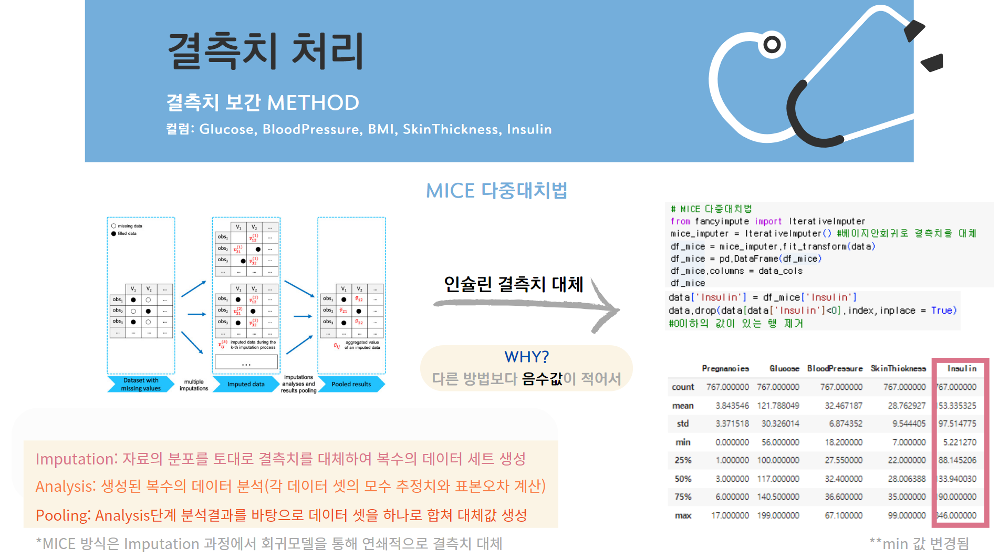
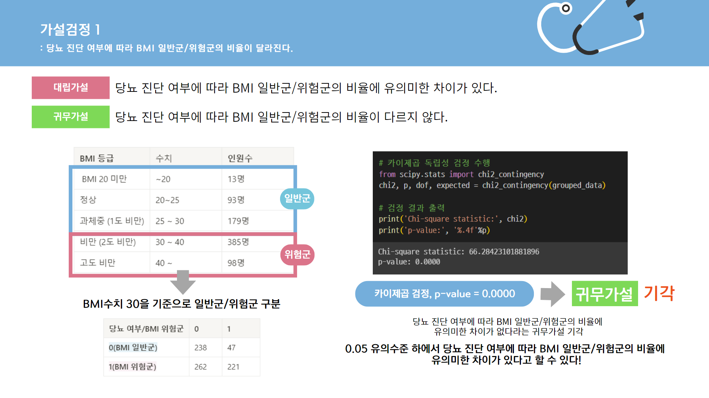

# Diabetes Toy Project

## 1) 프로젝트 수행 기간
2024년 3월 25일 ~ 4월 10일, 중앙대 비즈니스 데이터분석 학회의 토이프로젝트 활동

## 2) 진행 파트
데이터 전처리 및 결측치 보간

데이터 EDA

모델링

## 3) 프로젝트 소개
당뇨의 주된 원인을 유전적 요인과 환경적 요인으로 나누고, 가설을 검정을 통해 당뇨의 주된 원인을 판별하고 모델링을 통해 당뇨 여부에 영향을 미치는 변수를 분석함.  

## 4) 데이터
 피마 인디언 여성 당뇨 데이터
 
 9columns x 768 rows

## 5) 문제 상황
당뇨의 주된 원인은 무엇일까?

당뇨병의 원인이 유전이 되는 경우는 전체 당뇨 발병률의 1%에 불과한다는 서울 아산병원의 연구 결과와 전체 당뇨병 증가율인 24%보다 20대의 당뇨병 증가율이 47%로 매우 높다는 통계자료를 바탕으로 이번 프로젝트를 통해 당뇨에 대한 경각심을 일깨우고자 함.

따라서 유전적인 요인이라고 판단되는 __'당뇨병 혈통 함수'__ 변수와 환경적 요인이라고 판단되는 __'BMI'__ 변수를 가지고 두 가지의 가설을 세우고 검증함.

*가설 1: __당뇨 진단 여부에 따라 BMI 일반군/위험군의 비율이 달라진다.__*

*가설 2: __당뇨 진단 여부에 따라 혈통 함수에 차이가 생긴다.__*

## 6) 주요 분석 내용
> 결측치 보간 
글루코스, 혈압, BMI, 피부 두께, 인슐린 변수에서 의학적으로 나올 수 없는 수치인 0의 값을 확인하였고, 이를 결측치라고 판단함. 

결측치의 보간하기 위해 1. 평균값 대치, 2. 다중 선형 회귀 모델 예측 3. KNN Imutation, 4. Mice 다중 대치법을 사용하여 비교함. 

결측률이 낮은 ‘글루코스’, ‘BMI’, ‘혈압’ 변수는 각 변수의 평균값으로 대체하였고,

결측률이 높은 ‘인슐린’ 변수는 MICE 다중대치법을 사용하고 ‘피부 두께’ 변수는 다중 선형 회귀 분석을 사용함. 인슐린 변수의 결측치를 대체할 때 다른 Method와 비교하여 의학적으로 나올 수 없는 수치 값이 가장 적었기 때문에 MICE 다중 대치법을 사용함.

> 가설 검정
표본의 크기가 2000 이하이고, 샤피로-윌크 검정을 통해 정규성 검정을 진행한 결과, 모든 변수가 정규성을 만족하지 않았기 때문에 비모수 검정을 통해 가설을 검정함. 

**가설 1)** BMI 등급에 따라 일반군과 위험군으로 분류한 다음, 카이제곱 검정을 통해 당뇨 진단 여부에 따라 BMI 일반군/위험군의 비율에 유의미한 차이가 없다는 귀무가설을 기각함. 

**가설 2)** 비모수 검정인 맨휘트니 U 검정을 통해 당뇨 진단 여부에 따라 당뇨병 혈통 함수에 유의미한 차이가 없다는 귀무가설을 기각함.

> 모델링 
타겟값인 당뇨병 여부 변수에 대해 영향을 미치는 중요한 변수를 파악하기 위해 Classification 문제에 사용하는 Logistic Regression 모델을 사용함. 변수 값을 변화시키면서 예측값의 변화를 관찰하는 PDP Box로 시각화하여 파악함.    

## 7) 결론
유전적 요인인 당뇨병 혈통 함수 변수와 환경적 요인인 BMI 변수 모두 당뇨 발병에 영향을 준다는 가설 검정 결과와 환경적 요인은 유전적 요인에 영향을 미쳐 당뇨병 유발시킨다는 연구 결과를 바탕으로 당뇨에 있어 환경적인 원인이 더욱 크기 때문에 가족력이 없다고 안일할 것이 아니라 건강 관리에 힘써야 함.

## 8) Learning Point
결측치가 많고 충분하지 않은 데이터에서의 전처리 방식과 통계적 기법들을 적용할 수 있었음.

문제 상황을 정의하고 그에 맞는 가설을 설정하고 검정하는 과정을 수행함. 
